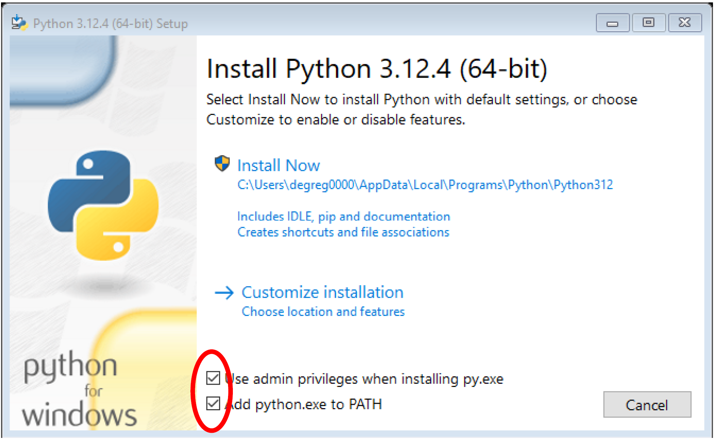

# Annotation Correction Tool

## Prepare your Machine
To prepare your machine, the only requirement is to install Python. You can easily download the installer from the official website: https://www.python.org/downloads/

**_NOTE:_** Pay attention to select the two checkboxes as shown in the image below!


## Download The Application
You can download the tool by clicking on the green `<> Code` button at the top right corner of this page and selecting the `Download ZIP` option.

Next, extract the ZIP archive to a location on your computer.

## Run the Application

### Windows
If you are using a Windows machine, you can run the application by executing the `run_windows.bat` file.

### MacOS or Linux-based
If you are using a MacOS or Linux machine, you can run the application by executing the `run_unix.sh` file.

### All Operating System
If you prefer not tu use bash file, this proicedure works for all operating systems. Open a terminal in the folder containing all the files of the tool and run the following command:
```terminal
python3 -m http.server 5500
```

After running the command, open a browser and navigate to the following page:

```
http://localhost:5500
```

**_NOTE_**: 5500 it is just a custom port, if you prefer you can use the port num,ber you prefer.

## Demo Video
You can find a video that explains how to run the software and how to use it at the following link:

 https://drive.google.com/file/d/1lGTcM2a7SqhyR420whAY-tVoYiSx4A4n/view?usp=sharing
